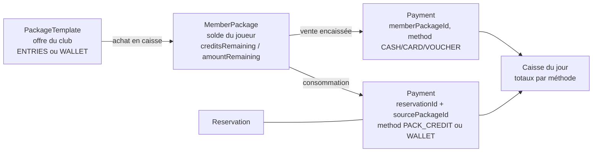

# Brief — Paiements en caisse : carnets, porte-monnaie, tickets CE (v1)

> **Statut** : brief prêt à lancer. Ce document est auto-portant : il contient les décisions
> produit, le design proposé et le **prompt affiné** à donner à une prochaine session pour
> implémenter la fonctionnalité via le process habituel spec/plan (superpowers).

## Contexte

Les clubs encaissent à l'accueil avec des moyens variés : espèces/carte, mais aussi
**tickets CE / chèques sport** (ANCV, Kadéos…) et **carnets** (ex. 10 entrées à prix réduit)
ou **avoirs prépayés en €**. La personne à l'accueil doit pouvoir gérer le paiement de
chaque réservation en caisse.

## Décisions produit (validées)

1. **Carnets = entrées ET porte-monnaie €** : le club choisit le type par offre
   (*carnet d'entrées* : 1 crédit = 1 réservation ; *porte-monnaie €* : chaque résa débite
   son prix exact).
2. **Le joueur peut consommer son carnet à la réservation en ligne** (pas seulement en caisse).
3. **Récap de caisse journalier** inclus dans le périmètre v1 (page `/admin/caisse`).
4. **Tickets CE = méthode de paiement dédiée** avec référence/émetteur et **suivi de
   remboursement** (à rembourser / remboursé).

## Ce qui existe déjà (à réutiliser, pas à réinventer)

- **`Payment`** (`backend/prisma/schema.prisma:267`) : encaissement manuel rattaché à une
  `Reservation`, multi-paiements par résa, enum `PaymentMethod` (CASH/CARD/TRANSFER/ONLINE/OTHER),
  `payerName`, `note`.
- **`reservationService.addPayment`** (`backend/src/services/reservation.service.ts:528`)
  + route `POST /api/clubs/:clubId/admin/reservations/:id/payments` (`backend/src/routes/admin.ts:271`).
- **Mini-caisse dans le planning admin** (`frontend/app/admin/planning/page.tsx`) : panneau
  « Encaisser € » avec choix de méthode, affichage « Reste dû » (`totalPrice − paidAmount`).
- **`ClubMembership`** = fichier membres (porte déjà `membershipNo`, statut) ; recherche
  membres par nom déjà exposée (`GET /api/clubs/:slug/members/search`).
- **Confirmation de résa** : transaction Serializable + FOR UPDATE + verrou Redis dans
  `reservation.service.ts` — la consommation d'un crédit à la résa devra s'insérer **dans
  cette même transaction**.
- Conventions : routes admin club-scopées derrière `requireClubRole`, services en classes,
  migrations Prisma **additives**, helpers purs dans `frontend/lib/`.

## Design proposé (v1)

### Modèle de données (migration additive)

- **`PackageTemplate`** (offre vendue par le club) : `clubId`, `kind` (`ENTRIES` | `WALLET`),
  `name`, `price` (prix de vente), `entriesCount?` (si ENTRIES), `walletAmount?` (montant
  crédité si WALLET, ex. 200 € crédités pour 180 € payés), `validityDays?`, `isActive`.
- **`MemberPackage`** (achat d'un joueur) : `clubId`, `userId`, `templateId`, `kind`,
  `creditsTotal/creditsRemaining` (ENTRIES) ou `amountTotal/amountRemaining` Decimal (WALLET),
  `purchasedAt`, `expiresAt?`.
- **`Payment` étendu** : `reservationId` devient **optionnel** ; nouveaux champs
  `memberPackageId?` (= vente d'un carnet), `sourcePackageId?` (= consommation d'un carnet
  sur une résa), `voucherRef?`, `voucherIssuer?`, `voucherStatus?` (enum
  `PENDING_REIMBURSEMENT`/`REIMBURSED`, null sinon).
- **`PaymentMethod` étendu** : `+ VOUCHER` (ticket CE/chèque sport), `+ PACK_CREDIT`
  (1 entrée du carnet, `amount` = prix de la résa pour solder le reste dû, crédits −1),
  `+ WALLET` (débit du solde €).
- Concurrence : décrément par update conditionnel (`creditsRemaining >= 1` /
  `amountRemaining >= montant`) dans la transaction — même philosophie que le zéro
  double-réservation.

### Backend

- `PackageService` (nouveau) : CRUD templates, vente (`MemberPackage` + `Payment` de vente
  dans une transaction), consommation, soldes d'un membre.
- Routes admin (mêmes patterns que `admin.ts`) : `GET/POST/PATCH /admin/packages/templates`,
  `POST /admin/members/:userId/packages` (vente + encaissement),
  `GET /admin/members/:userId/packages`.
- `addPayment` étendu : accepte `PACK_CREDIT`/`WALLET` + `sourcePackageId` (vérifie solde,
  club, propriétaire) et `VOUCHER` + `voucherRef/voucherIssuer`.
- **Caisse** : `GET /admin/caisse?date=` → totaux du jour par méthode + liste des
  encaissements + reste dû du jour ; `GET /admin/caisse/vouchers?status=`
  + `PATCH /admin/payments/:id/voucher` (marquer remboursé).
- **Côté joueur** : `GET /api/clubs/:slug/me/packages` (soldes) ; la confirmation de résa
  accepte `paymentSource: { packageId }` → consommation dans la transaction Serializable
  existante (échec de solde = la résa reste payable autrement, pas de demi-état).

### Frontend

- **Nouvelle page `/admin/caisse`** : récap du jour (totaux par méthode, reste dû),
  recherche membre (annuaire existant) → soldes + vente de carnet, liste des tickets CE
  à rembourser.
- **Planning admin** : le panneau « Encaisser » propose en plus
  « Carnet (7 entrées restantes) » / « Porte-monnaie (53 €) » quand la résa a un user avec
  un package actif, et « Ticket CE » avec champ référence.
- **Joueur** : soldes dans `/me` ; dans le BookingModal de `/reserver`, option
  « Payer avec mon carnet » à la confirmation.
- **Admin settings/packages** : gestion des offres (templates).

### Hors périmètre v1

Paiement en ligne CB (Stripe…), remboursements automatiques à l'annulation (v1 : l'accueil
recrédite manuellement le carnet), comptabilité export, frais d'inscription tournoi
(reste informatif).

## Prompt affiné (livrable principal — à lancer dans une prochaine session)

> **Contexte** : Palova, app de réservation de terrains de padel (backend Express 5 +
> Prisma 7 + Redis, frontend Next.js 16 — voir CLAUDE.md). Il existe déjà un modèle
> `Payment` (encaissements manuels multi-paiements par réservation, méthodes
> CASH/CARD/TRANSFER/ONLINE/OTHER) avec un panneau « Encaisser » et un « Reste dû » dans
> `/admin/planning`, le fichier membres `ClubMembership`, et un annuaire de recherche de
> membres par nom.
>
> **Fonctionnalité à implémenter — « Caisse & carnets » (v1)** : permettre à l'accueil du
> club de gérer tous les paiements en caisse, et aux clubs de vendre des formules prépayées.
>
> 1. **Offres prépayées** : le club définit des offres de deux types — *carnet d'entrées*
>    (ex. 10 entrées à 200 € au lieu de 250 €, 1 crédit = 1 réservation) et
>    *porte-monnaie €* (ex. 200 € crédités pour 180 € payés, chaque résa débite son prix
>    exact). Validité optionnelle en jours. Gestion des offres dans le back-office club.
> 2. **Vente en caisse** : l'accueil recherche un membre (annuaire existant), lui vend une
>    offre et encaisse la vente (espèces/carte/ticket CE) ; le membre obtient un solde
>    (crédits ou €) suivi en base, avec décréments concurrents-sûrs (update conditionnel
>    en transaction, même rigueur que le zéro double-réservation).
> 3. **Encaissement d'une réservation** : étendre le panneau « Encaisser » du planning
>    admin — nouvelles méthodes *Ticket CE* (avec référence + émetteur), *Carnet*
>    (consomme 1 entrée et solde la résa) et *Porte-monnaie* (débite le solde), affichées
>    avec le solde restant du joueur. Paiements partiels/multiples déjà supportés :
>    conserver ce comportement.
> 4. **Tickets CE / chèques sport** : méthode `VOUCHER` avec référence et statut
>    *à rembourser / remboursé* ; vue listant les tickets en attente avec action
>    « marquer remboursé ».
> 5. **Caisse du jour** : nouvelle page `/admin/caisse` — totaux encaissés du jour par
>    méthode, liste des encaissements, reste dû du jour, accès vente de carnet et
>    tickets CE.
> 6. **Côté joueur** : voir ses soldes (carnets/porte-monnaie) dans son profil, et pouvoir
>    payer avec son carnet ou son porte-monnaie au moment de confirmer une réservation en
>    ligne (la consommation se fait dans la transaction Serializable existante de
>    confirmation ; si le solde est insuffisant, la résa reste réservable avec paiement
>    en caisse).
>
> **Contraintes** : migration Prisma additive uniquement (`Payment.reservationId` peut
> devenir optionnel) ; routes admin club-scopées derrière les middlewares existants ;
> aucun paiement en ligne CB en v1 ; pas de remboursement automatique à l'annulation
> (l'accueil recrédite manuellement) ; tests Jest sur le service (solde insuffisant,
> double consommation concurrente, vente+encaissement transactionnels) ; mettre à jour
> CLAUDE.md.
